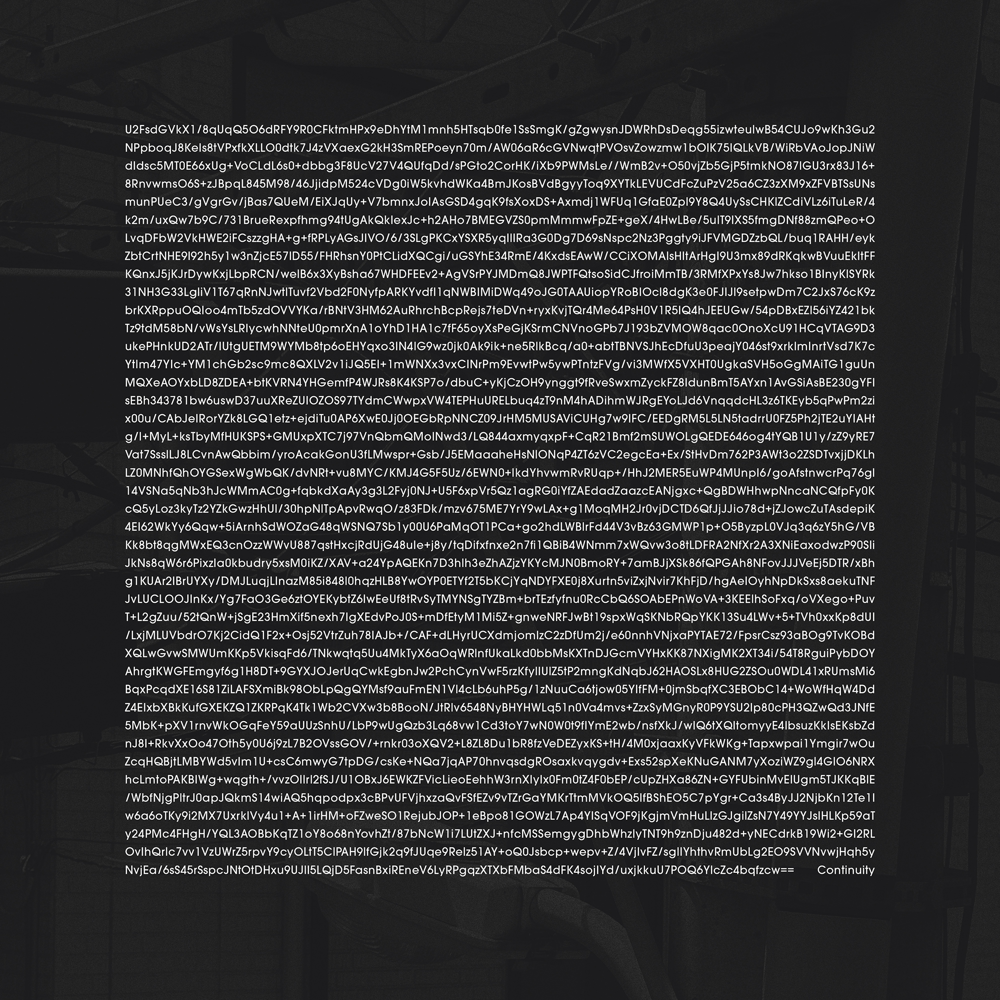

# Continuity

&nbsp;

## 🔐 Album Artwork Decryption Guide

This repository contains the encrypted text featured on the album cover for *Continuity* by Yann Novak.

To decrypt it:

1. Visit: [https://encrypt-online.com/decrypt](https://encrypt-online.com/decrypt)
2. Select **aes-256-cbc** as the encryption method (this should be the default)
3. Paste the contents of `encrypted-text.txt` into the input field
4. Use the album title — **`Continuity`** (capital **C**) — as the passphrase
5. Click **Decrypt**

&nbsp;

> ⚠️ Make sure to copy the encrypted text **exactly**, with no extra spaces or line breaks.

&nbsp;

## 💾 Files

- `encrypted-text.txt`: The raw AES-encrypted string extracted from the album cover
- `continuity-cover.jpg` – Full-size album cover image (high resolution)
- `continuity-cover-small.jpg` – Reduced-size image used for preview in this README

&nbsp;

## 🎧 Listen or Buy

- **Bandcamp**: [Buy or stream on Bandcamp](https://yannnovak.bandcamp.com/album/continuity)
- **Streaming**: Available on all major platforms (TIDAL, Apple Music, Spotify, etc.)
- **Label**: Released by [Room40](https://room40.org)

&nbsp;

## ℹ️ About the Project

The album cover for *Continuity* contains an encrypted version of the description/essay that accompanies the album. This guide allows fans to decrypt it without the hurdles of copying text from a JPG.
